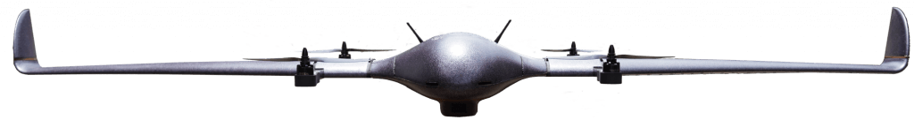

# Introduction

## Introduction

This document describes how to setup, operate and maintain your DeltaQuad series VTOL UAV Version 2. To identify your vehicle version, please see the serial number sticker inside the UAV. This will indicate:\
\
Version 1: DeltaQuad Pro\
Version 2: DeltaQuad Pro V2

For version 1, please refer to the [version 1 documentation](https://docs.deltaquad.com/deltaquad-operation-manual/v/master/)

This manual in PDF file format: [DeltaQuad Operations Manual.pdf](https://docs.deltaquad.com/DeltaQuad%20Operations%20Manual.pdf)

## Safety & Legal notice

* The vehicle must be operated in accordance with local laws and regulations.
* The vehicle may not be operated or flown near or over people, roads, vehicles, buildings or anything that could result in damage or danger to people or property.
* All missions must be validated and pass the [DeltaQuad Mission Validator](https://validator.deltaquad.com)
* Radio or video transmitters might require special licensing and/or permits.
* Vertical Technologies or its affiliates can not be held responsible for vehicles that have not been operated or maintained in accordance with the guidelines set forth in this manual, or for behavior resulting from changes made to the vehicle.
* This operations manual is provided "As-Is". No rights can be obtained from the contents of this manual.
* Software used in conjunction with the vehicle is provided under their respective license and warranty.
* The vehicle is provided in accordance with the Vertical Technologies [Warranty](https://www.verticaltechnologies.com/info/warranty-and-support) and under the Vertical Technologies [Terms & Conditions](https://www.verticaltechnologies.com/info/terms-conditions)
