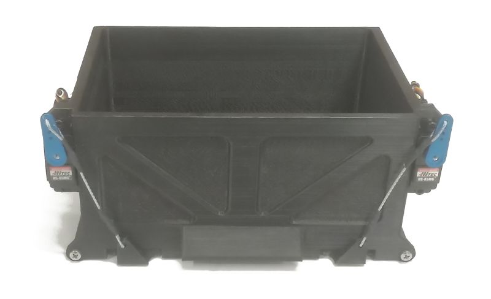

# Payload Drop Mechanism

If your DeltaQuad is equipped with a Payload Drop Mechanism (PDM) you may use the following instructions to operate the PDM. Please note that dropping payloads from a UAV might require special permits. Please check with your local authorities before using the payload drop mechanism. Never operate the PDM near people, roads or property.

## Mechanical

The PDM consists of a payload bay with 2 payload doors that are operated by servo motors. The Servo motors are attached to the payload doors with steel rods. Never operate the payload doors when they are obstructed as this might damage the system..

| Payload bay dimensions | 10 cm x 15 cm x 9 cm |
| ---------------------- | -------------------- |
| Payload capacity       | 1 Kg                 |

## Operating the PDM

When the payload doors are triggered, either manually or from a mission command, the doors open for 3 seconds, and then automatically close. From the Ground Control Station the PDM is considered a camera system. It uses the camera trigger functionality to operate.

### Testing the payload doors

> WARNING: never trigger the payload doors when the vehicle is sitting on the gound with the payload doors obstructed. This may damage your PDM.

To test the payload doors position the vehicle such that the doors can open unobstructed, you could place the vehicle between 2 tables for example. Then use the following steps;

1. Switch the vehicle and Ground Control Station on
2. From the "Fly" screen, tap the drop-down box that reads "Values" and select "Camera"
3. Press the "Trigger Camera" button

This method can also be used to manually control when the payload is dropped during a mission flight.

### Dropping the payload during a mission

Payloads can be dropped while the vehicle is flying as a fixed wing (airplane mode) or as multi rotor (hover mode). Fixed wing drops are the easiest, safest and the most efficient in terms of battery consumption, but they are not very precise. Multi rotor drops are very precise but require significantly more energy and low wind conditions.

For payload drops please consider the following;

* Do not set camera patterns such as Survey or Corridor scan, doing this will trigger the payload drop mechanism.
* Payloads are dropped from the altitude the vehicle is maintaining, payloads should be able to resist falling from such a height without damage, or they should be equipped with a parachute
* Wind can affect where the payload is dropped. In fixed wing mode It is advised to face the wind direction when dropping the payload.

#### Fixed wing drop

To plan a drop in fixed wing mode please ensure the drop zone area is at least 50 meters or more. Plan your mission using the following steps;

1. Plan a standard mission as indicated in the[ Planning a mission](https://github.com/sanderux/deltaquad-operation-manual/tree/93d3490d8ac10b7370f644e4427b43a5c6704b55/flight/planning-a-mission.html) section.
2. Place a waypoint on the target drop zone
3. Change the "Hold" value of the waypoint to 4 seconds, indicated below (1)
   1. If the payload is dropped too late use a lower value
   2. If the payload is dropped too soon use a higher value
4. Expand the "Camera" options by clicking on it
5. Set the camera action to "Take photo", indicated below (2)

#### Multi rotor precision drop

When planning a precision drop the vehicle will return to hover mode, drop the payload, and return back to fixed wing mode. This requires proper planning and should only be performed in low wind conditions (< 6m/s). When using precision drop please make sure that the vehicle has sufficient battery power to do so. At minimum 20% battery use must be considered for this procedure.

To plan a precision drop use the following steps;

1. Plan a standard mission as indicated in the[ Planning a mission](https://github.com/sanderux/deltaquad-operation-manual/tree/93d3490d8ac10b7370f644e4427b43a5c6704b55/flight/planning-a-mission.html) section.
2. Place a waypoint 2 meters before the target drop zone
3. Place an extra waypoint near the drop zone, as indicated below (1)
   1. Change the category to VTOL
   2. Select VTOL Transition
   3. Select the mode "Hover mode"
4. Place a waypoint on top of the drop zone
   1. Change the "Hold" value to 2 seconds, as indicated below (2)
   2. Expand the "Camera" options by clicking on it
   3. Set the camera action to "Take Photo" as indicated below (3)
5. Place an extra waypoint after the drop waypoint
   1. Change the category to "VTOL"
   2. Select VTOL Transition
   3. Select the mode "Plane mode"
6. Make sure the next waypoint is at least 300m away from the drop zone, and in a straight line in relation to the approach path.
7. If the altitude of the drop zone was lowered (< 40m) then make sure the altitude is increased again before performing the transition to fixed wing mode. This can be done by placing an extra waypoint 2 meters after the payload drop waypoint with the correct altitude.

### Sample missions

The following sample mission shows how to plan a standard "Fixed wing" drop. You can import this mission in the Ground Control Station as an example on how to plan a fixed wing payload drop.

[PDM.plan](https://github.com/sanderux/deltaquad-operation-manual/tree/93d3490d8ac10b7370f644e4427b43a5c6704b55/assets/PDM.plan)

The following sample mission shows how to plan a precision "Multi rotor" drop. You can import this mission in the Ground Control Station as an example on how to plan a fixed wing payload drop.

[PDM precision.plan](https://github.com/sanderux/deltaquad-operation-manual/tree/93d3490d8ac10b7370f644e4427b43a5c6704b55/assets/PDM%20precision.plan)
