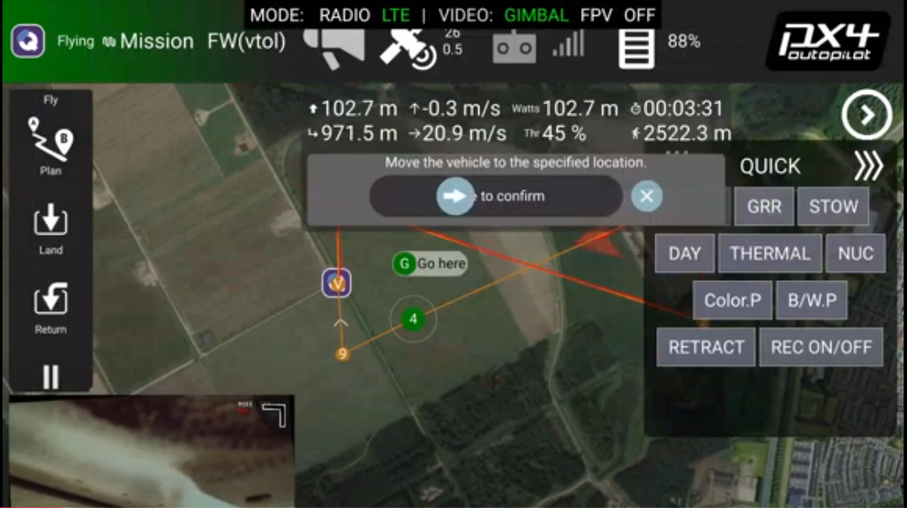

# Controlling the Vehicle

## Introduction

The QGroundControl Application that is installed on your DeltaQuad Controller or tablet is the main application to control your UAV.&#x20;

## Mission planning

Before starting a flight a mission needs to be planned to instruct the vehicle on the takeoff and landing patterns. You can choose to plan a full mapping mission, or only plan a takeoff and landing mission. It is possible to take control of the vehicle after takeoff, and initiate a Return command when the mission has ended. The vehicle will use the landing pattern from the mission plan to execute a return command.

When starting the QGroundControl application the FLY view is displayed.

From the FLY view you will need to switch to the PLAN view to plan your mission. You can switch to the PLAN view by pressing the PLAN button on the left side command bar.

Please review the [mission planning section](../flight/planning-a-mission.md) for detailed information on planning a mission.

## Launching your vehicle

Once your mission is uploaded you can return to the FLY view by pressing the FLY button in the left side command bar. Once you have performed the [preflight checks](../flight/pre-flight-checks.md) you can start the mission by sliding to confirm the Start Mission command. If the slider is not displayed you can press the ACTION button in the left side command bar and choose "start mission". When sliding to confirm the takeoff your vehicle will start its motors and takeoff.&#x20;

Before starting your first flight, you will need to be familiar with the DeltaQuad Controller button and joystick functions as described in the [DeltaQuad Controller section](../deltaquad-pro-view/deltaquad-controller.md).&#x20;


_NOTE: Before launching, make sure all switches are in their center position, all dials are turned all the way to the left, and the deploy button is switched off. Always make sure the Transition Direction (waypoint 1) is the active waypoint, indicated by a green circle._


## Operating your vehicle

Once the vehicle is launched and has transitioned to fixed-wing flight mode, you can control the flight of your vehicle through the following methods.

### Repositioning the vehicle

While the vehicle is in flight, you can tap anywhere on the satellite map and choose "Goto location".

After sliding to confirm the reposition command, the vehicle will enter "HOLD" flight mode, fly towards the indicated location, and circle the location clockwise in a radius of 100m.

### Joystick control

The vehicle can be controlled using the right side joystick (7). To activate joystick control, switch the flight mode switch (1) to POSITION mode (UP). In this mode, the vehicle will fly in a straight line at its current altitude until a joystick command is received.

Moving the joystick left or right will make the vehicle change direction.

Moving the joystick forward or backward controls the altitude of the vehicle. A forward (up) joystick movement moves the nose of the vehicle down and decreases altitude. A backward (down) joystick movement pulls the nose of the vehicle up and increases altitude.

If the vehicle loses connection to the DeltaQuad Controller while it is flying in POSITION mode, it will automatically return home, regardless of the [Safety settings](../setup/safety-features.md).


_NOTE: for inexperienced pilots, the joystick controls can seem counterintuitive. It is recommended to practice joystick operation in close proximity while flying at sufficient altitude._


## Changing altitude

While the vehicle is in POSITION or HOLD mode, the altitude can be changed by tapping on the ACTION button in the FLY screen and selecting "change altitude". A vertical slider will appear on the right side of the screen that allows you to select a new altitude. Once the correct altitude is selected, slide the "change altitude" slider to confirm the altitude change command.

When the vehicle is following a mission path, it will always track the altitude as defined in the mission plan. When resuming a mission the vehicle will immediately change the altitude to match the currently active waypoint.

## Resuming a mission

When the vehicle is in POSITION or HOLD mode, the mission can be resumed by moving the flight mode switch to the MISSION position. Alternatively, the mission can be resumed by tapping on the ACTION button on the FLY screen and selecting "resume mission".

## Returning the vehicle

At any point in the flight, the vehicle can be returned by activating the RETURN switch. Alternatively, RETURN mode can be activated by tapping on the RETURN button on the FLY screen, and sliding to confirm the command.

In RETURN mode, the vehicle will immediately fly towards the landing pattern that was defined in the mission. The landing pattern consists of a circle to altitude item, a direction and altitude on which to exit the circle, and a landing coordinate.

When RETURN mode is activated, the vehicle will fly at its current altitude towards the 'circle to altitude' part of the landing pattern. When reaching this location the vehicle will circle down to the indicated altitude, and complete the circle until it has reached the indicated exit heading of the circle. It will then proceed towards the landing coordinates, transition to multirotor flight mode, and land on the indicated position.

## Controlling the vehicle in multirotor mode

During takeoff or landing, your vehicle is in multirotor mode. Multirotor mode means the 4 motors for Vertical takeoff and Landing are activated.

To take control of the vehicle in multirotor mode, change the flight mode switch to POSITION mode. In this mode, the vehicle will hold its position and altitude until joystick commands are received.

The LEFT main joystick (12) controls the vehicle's altitude and heading. Moving the joystick UP will increase the altitude. Moving the joystick down will decrease the altitude. Moving the joystick left or right changes the heading (yaw) of the vehicle.

The RIGHT joystick (7) controls the position of the vehicle. Moving this joystick, forward, backward, left or right changes the position of the vehicle relative to its current heading.

