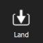
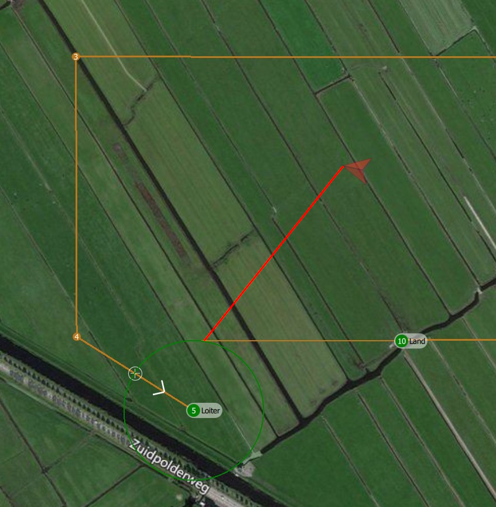
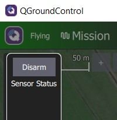
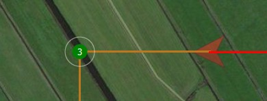

# Executing and monitoring a mission

Before executing a mission the following conditions must have been met:

1. The mission must be planned in accordance with the guidelines set out in [Planning a mission](planning-a-mission.md).
2. The mission plan must have passed the [DeltaQuad mission plan validator](https://validator.deltaquad.com).
3. The [Pre-flight checks](pre-flight-checks.md) must have been performed and passed.
4. The vehicle should be pointing with its nose towards the wind.
5. The operator and any observers must keep a safe distance from the vehicle, 10m minimum recommended.

## Setting up the Fly screen

From the [Ground Control Station](ground-control-station-overview.md) (GCS) activate the Fly screen.&#x20;

.png>)

From the Fly screen, ensure all key telemetry data "A" has been activated. The key telemetry data can be configured by clicking anywhere on the telemetry display.&#x20;

You will now have the possibility to add vertically and horizontally extra lines to the display by using the "plus" and "minus" signs or to change the category of the existing telemetry data.

By clicking on any of the displayed values a window will open which gives you the option to select any of the available data to be displayed in the field where you clicked.

By clicking the "Lock" you finish the setup and lock the telemetry data display.

The following telemetry data is recommended:

* Altitude-rel: The relative altitude of the vehicle compared to its home position.
* Ground speed: The ground speed in meters per second.
* Current: The amount of Current in Amperes currently consumed by the vehicle.
* Consumed: The total amount of current drawn from the battery since starting the vehicle.
* Pitch: The current pitch angle in degrees.
* Roll: The current roll angle in degrees.
* Flight time: The total flight time from the moment of arming the vehicle.
* Distance to home: The distance in meters from the takeoff location.

## Execute the mission

When all checks are performed, and everything is set up and working properly, you can start the mission. The mission can be started by sliding the "Start mission" activator to the right as indicated under "C". If the start mission block has been closed this will be available under the action button "B".

## Returning the vehicle during a mission

When the vehicle needs to be returned while executing a mission, the recommended method is to direct the UAV towards a waypoint that will provide a clean entry into the pre-defined landing sequence. You can change the active waypoint that the vehicle is following by clicking the desired waypoint from the fly screen and confirming the change request.

Please note: when changing the active waypoint, the vehicle will immediately change its altitude to the altitude of the selected item. It will not gradually climb or descend but reach the new altitude as fast as possible. It is therefore recommended to select a waypoint that has an altitude at which the vehicle can safely return from its current position. If a waypoint with a safe altitude is not available, it is recommended to first reposition the UAV to a safe location by tapping a location on the map. While repositioning the UAV it will maintain its current altitude.

Using the simulator is recommended to practice returning the UAV during a mission using the method described in this section.

## Monitoring the mission

Throughout the mission, both the telemetry data and the vehicle should be monitored. This task can be performed by a single operator, but it is recommended to perform this task with one operator and an observer. The observer should continue to watch the vehicle and its surroundings and alert the operator of any problems or nearby traffic.

**Note:** It is highly recommended to practice the following exercise in the simulator several times before operating the vehicle.

From the flight screen, and when the vehicle is armed, the following key functions are available:

**LAND (A): Land immediately.**&#x20;

The vehicle will land at its current location. If the vehicle is in Fixed Wing mode the vehicle will transition back to quadcopter mode first.&#x20;

This button is called "Take off" while on the ground.

.jpg>)

**RTL (B): Return To Launch.**&#x20;

The vehicle will return to its takeoff point via the "Landing Pattern" command which consists of the "Loiter" waypoint and the "Land" item.&#x20;

The vehicle will reach the "Landing Pattern" command in a straight line from its current location at its current altitude. If the current altitude is lower than the Return Home altitude in the [Safety settings](../setup/safety-features.md) it will climb to this altitude. If the vehicle is flying in Quadcopter mode it will return to the "Landing Pattern" command and land in this mode. If the vehicle is in Fixed Wing mode it will return as Fixed Wing to the "Landing Pattern" command, perform a back transition when reaching the takeoff location, and land in quadcopter mode.&#x20;

The advantage of facilitating the "Landing Pattern" command is that it will provide a clean entry into the pre-defined landing sequence and executing the transition and landing into the wind.&#x20;

**Note: using RTL is a last resort. The recommended method of returning the vehicle in fixed-wing mode is described in the section "Returning the vehicle during a mission" above.**

**PAUSE (C): The vehicle will hold its current position.**&#x20;

In Fixed Wing mode it will circle the current position with a radius of 100 meters. While in pause mode, when there are no open dialogs, tapping anywhere on the map will give you the ability to select "Goto location".&#x20;

When sliding to confirm the goto command, the vehicle will proceed to the selected location.&#x20;

**ACTION (D): The "Action" button.**

With the "Action" button the mission can proceed, or the flight altitude can be changed. The "Action" button becomes available when the vehicle is in HOLD mode (pause). See the picture below.&#x20;

.png>)

When tapping the action button two options become available.&#x20;

CONTINUE MISSION will resume the mission towards the next waypoint indicated by a green color. If the option CONTINUE MISSION is not available you can resume the mission by switching to MISSION mode using the "Flight Mode" button.

CHANGE ALTITUDE will present a slider on the right side of the screen to change the vehicle's altitude.&#x20;

The minimum and maximum altitudes can be set in the "Application Settings" under the "Q" icon.

.png>)

**FLYING/READY TO FLY (E):** This button will indicate the current state of the DeltaQuad.&#x20;

When the vehicle is in flight (armed) this button can be clicked and the option to "Disarm" the vehicle will appear.&#x20;

When clicking the "Disarm" button an the emergency stop box will appear.&#x20;

When confirming the emergency stop all motors will stop **IMMEDIATELY.** This procedure should only be used while the vehicle is on the ground or as a last resort to avoid damage to people or property.&#x20;

**Note: Using this function during flight will crash your vehicle and void your warranty.**

**FLIGHT MODE (F):** This button displays the current flight mode. By tapping this button a new flight mode can be selected. Supported flight modes are HOLD, RETURN, and MISSION. Switching flight modes using this method will not require slider confirmation. **Note:** **When a new flight mode is selected this will be activated immediately.**

**VTOL MODE (G):** This button indicates if the vehicle is currently in multi-rotor or fixed-wing mode. Tapping this button will provide the option to switch mode.&#x20;

.jpg>)

At altitudes higher than 100m above ground, or in strong winds, it is not recommended to switch from fixed-wing to multi-rotor mode.

**WAYPOINT items:**&#x20;

The waypoint items on the screen can be tapped. When tapped a dialog appears asking if the vehicle should proceed to the selected waypoint. When confirmed the vehicle will proceed in a straight line towards the selected waypoint. It will also immediately change to the altitude of the selected waypoint.

The operator should monitor the following:

### During takeoff

The following should be monitored directly after takeoff while the vehicle is ascending vertically to its transition altitude.

**Toilet bowling**\
****Operator action: **LAND**\
The vehicle should takeoff in a straight line after the first few meters. If the vehicle starts "toilet bowling" (circling up) the mission should be aborted and a [sensor calibration](../maintenance/sensor-calibration.md) must be performed.

**Not holding position**  \
****Operator action: **LAND**\
The vehicle should takeoff in a straight line. If the vehicle starts drifting from its position more than a few meters it should be commanded to LAND. Contact Vertical Technologies support to have your log files analyzed.

**Takeoff failure**  \
****Operator action: **DISARM**\
If the vehicle fails to takeoff or only one half of the vehicle rises it is likely that the quadcopter propellers are damaged, mounted incorrectly or upside down. The operator should disarm the vehicle and review the propellers configuration as described in the [assembly section](../setup/assembly.md).

**Excessive current draw**  \
****Operator action: **LAND**  \
****If the current draw indicated by CURRENT from the telemetry display exceeds 180 Amperes the flight should be aborted. The vehicle could be over weight, flying outside of [tolerable wind conditions](../vehicle-specifications.md) or has a malfunction. In the case of a malfunction inspect the vehicle for visible damage to the propellers or a higher resistance in any of the motors. If there was no evident damage then contact Vertical Technologies support for analysis.

### During transition

After reaching transition altitude the vehicle will commence the transition to fixed-wing flight. (switching from quadcopter to fixed wing). It will transition into the direction that the vehicle was placed in, but wind can have an effect on the direction, especially if the vehicle was not positioned with its nose directly into the wind. The vehicle will engage full thrust for 15 seconds using its pusher motor. After this period it should navigate towards the takeoff location or the first waypoint.

**No forward motion**  \
****Operator action: **LAND**  \
****If the vehicle is not moving forward or is drifting with the wind and does not seem to transition towards fixed wing there is likely a problem with the pusher motor or propeller.

**Flying backward**  \
****Operator action: **LAND**  \
****If the vehicle starts flying backward with increasing speed it is likely to have the pusher propeller mounted in the wrong direction. The transition should be aborted and the pusher motor should be inspected.

**High current slow forward flight**  \
****Operator action: **RTL**  \
****If the vehicle is moving horizontally in the direction of the first waypoint at low speed, with the quadcopter motors still engaged after 15 seconds, and the current draw remains above 30 Amperes, it is likely that the mission did not issue a VTOL TAKEOFF command but a TAKEOFF command. The vehicle will attempt to complete the mission in quadcopter mode. If this was not intended, RTL should be initiated by the operator.\
**Note:** The DeltaQuad can activate its pusher motor in quadcopter mode too. The spinning of the pusher motor is no indication that the vehicle is attempting fixed wing flight.

### During Fixed Wing flight

**Abort error displayed due to loss of altitude or maximum bank angle**\
****Operator action: **LAND**\
****This error is displayed on the Ground Control Station when the vehicle has activated the failsafe system. The UAV must be landed as soon as possible. Do not attempt to complete the automatic return sequence if the vehicle is higher than 100m or further than 800m from the home position. If the battery is lower than 35% it should always be landed. Use the map to locate a safe area to land the UAV and direct the UAV to this location. Then press the LAND button to land immediately.

**Excessive altitude loss**  \
****Operator action: **Return or LAND**  \
****During and shortly after transition, the vehicle may lose some altitude, this is generally not more than 5 meters. In extreme cases (high payload, strong wind). This can be up to 8 meters. The vehicle should recover from this loss quickly, regain and maintain altitude. Some altitude gain or loss may occur when banking (changing direction). This should not exceed 5 meters.

If the vehicle does not maintain altitude, or if the altitude error exceeds 10m and the vehicle does not recover from this altitude error an RTL should be commanded. If the vehicle does not adequately perform the RTL procedure (continues to lose altitude or fails to navigate back) a LAND instruction should be given. After a LAND instruction is given, and the vehicle is performing a landing in quadcopter mode, the RTL instruction can be given again to have the vehicle return in quadcopter mode. This should only be attempted when the vehicle is less than 1km from the takeoff site and more than 50% of the battery capacity is available.

The reason this can occur could be related to weight, balance or a problem with the servos or pusher drive. A thorough inspection of the vehicle is required. If the problem can not be found and resolved you should contact Vertical Technologies support.

**Failure to track mission path**  \
****Operator action: **Return or LAND**  \
****During the transition the vehicle does not fly in the direction expected:

When the transition phase completes, the vehicle should fly towards its takeoff location or first waypoint. If the vehicle does not follow its intended path after the transition phase, a RTL should be commanded. If the vehicle does not adequately perform the RTL procedure (continues to lose altitude or fails to navigate back) a LAND instruction should be given. After a LAND instruction was given, and the vehicle is commencing a landing in quadcopter mode, the RTL instruction can be given again to have the vehicle return in quadcopter mode. This should only be attempted when the vehicle is less than 1km from the takeoff site and more then 70% of the battery capacity is available.

The reason this can occur can be related to a failure of the servo actuation or incorrect mission loaded.

**Excessive pitch**  \
****Operator action: **Increase cruise throttle / Return**  \
****The DeltaQuad should cruise at an average pitch angle between 3 and 9 degrees unless a change in altitude was commanded. If the pitch angle consistently exceeds 12 degrees while the vehicle is not attempting to climb to a higher altitude the cruise throttle should be increased. Increasing the cruise throttle can be done by changing the parameter as described in the [Key parameters section](../setup/key-parameters.md). This parameter can be changed during flight. If this does not resolve the problem the flight should be aborted by issuing an RTL command.\
**Note:** When changing the cruise throttle during flight special care must be taken to monitor the battery level.

The reason for this could be related to [sensor calibration](../maintenance/sensor-calibration.md), over weight, too low [cruise throttle](../setup/key-parameters.md) or a problem with the fixed wing drive. To resolve this attempt to level the vehicle as described in the sensor calibration section, verify the weight or increase the cruise throttle. If the problem persists please contact Vertical Technologies support.

**Battery level and current consumption**  \
****Operator action: **Return**  \
****The battery level percentage indicated in the top bar of the flight screen should be monitored throughout the flight. the percentage should always be higher than the relative distance the vehicle still has to travel. For example, if only 50% battery remains, more than 50% of the mission should have been completed. The CURRENT and CONSUMED values will also help determine this. The DeltaQuad should draw between 9 and 15 Amperes of current on average during cruise flight. This value increases;

* The vehicle is flying significantly above sea level
* If the vehicle is flying with maximum payload.
* As the battery percentage drops.
* When the vehicle is climbing or banking.
* When the cruise throttle is set higher.
* When the LiPo gets older.
* When a power consuming payload is active.

**Ground speed**  \
****Operator action: **Increase cruise throttle**  \
****The DeltaQuad will generally maintain a constant speed through air, but wind conditions will impact the effective ground speed. If the ground speed drops below 6 m/s the cruise throttle should be increased. Increasing the cruise throttle can be done by changing the parameter as described in the [Key parameters section](https://www.gitbook.com/book/sanderux/deltaquad-operation-manual/edit#). This parameter can be changed during flight.\
**Note:** When changing the cruise throttle during flight special care must be taken to monitor the battery level.

When this happens the vehicle is likely flying in wind conditions that exceed the [specified tolerance](../vehicle-specifications.md).

### During back transition

When the DeltaQuad is flying towards its last waypoint (the VTOL\_LAND waypoint) it will determine the appropriate distance from the waypoint to initiate its back transition. The distance depends on the current ground speed and can vary between 5 and 100 meters from the land position. During the back transition the DeltaQuad will activate its pusher motor in reverse direction to slow down.

**Excessive overshoot**  \
****Operator action: **None**\
If the vehicle overshoots its landing waypoint significantly and does not seem to slow down during back transition, there could be a problem with the pusher reverse system. The vehicle should be thoroughly inspected for loose connectors on the flight controller (specifically connectors 7 and 8 as indicated on the [wiring diagram](https://www.verticaltechnologies.com/info/tech-specs-wiring-and-electronics)). If no problem was found with the connectors the vehicle should be grounded and undergo extended maintenance.

**Unstable descent**  \
****Operator action: **None**\
If the vehicle becomes unstable during landing the land speed as indicated in the [safety features](../setup/safety-features.md) is likely set too high.

**No auto disarm after touch down**  \
****Operator action: **Disarm**  \
****The DeltaQuad should disarm automatically 5 to 10 seconds after touch down. If the vehicle does not disarm automatically the disarm command (emergency stop) should be sent. This command can be sent by pressing the "Armed" label.

The reason for this could be related to landing on a significantly uneven or surface or slope. It can also indicate the sensors need [calibration](../maintenance/sensor-calibration.md).
