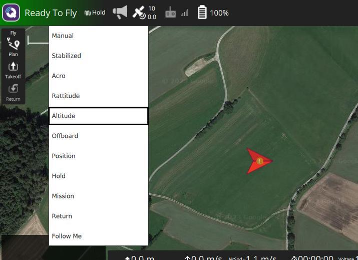

# Manual override

Using the DeltaQuad Controller, The vehicle is capable of being controlled in a manual override mode referred to as ALTITUDE mode. This mode is useful in the following conditions:

1. When the vehicle is flying in GPS-denied environments
2. When granular control over the vehicle is required
3. When the vehicle experiences a compass misalignment during takeoff or landing

### Safety warnings

* Altitude mode requires some piloting skills and should only be performed by operators that have some experience flying drones using joysticks.
* While in multirotor mode, the pusher motor can still activate if the vehicle is more than 3 meters above the ground and forward movement is requested.
* If the data link is lost during Altitude mode, the vehicle will always activate an automatic return mode, regardless of the safety settings.

### ALTITUDE mode explained

In ALTITUDE mode the vehicle no longer relies on the GPS or compass sensor data. It will maintain altitude based on the barometer and accelerometer data only. The vehicle is capable of flight in this mode both in multirotor and fixed-wing mode.&#x20;

As the vehicle does not use positioning data in this mode, wind can cause the vehicle to drift away.  It is the pilot's responsibility to position the vehicle by using the control joysticks on the DeltaQuad Controller.

### Activating ALTITUDE mode

To activate ALTITUDE mode tap on the flight mode button in the top bar.

<figure><figcaption></figcaption></figure>

This will present a dropdown menu with a list of all flight modes. Taping on the word "Altitude" will activate the Altitude flight mode.

<figure><figcaption></figcaption></figure>


Caution: when tapping on a flight mode from this menu, the flight mode is applied immediately, there is no confirmation required. If the wrong flight mode is selected, press the pause button before deciding your next step.


### Controlling the vehicle in ALTITUDE mode

In multirotor mode, the left joystick's up and down position controls the desired altitude. The center position will hold the current altitude, moving the joystick up or down will result in upward or downward movement of the UAV.&#x20;

In fixed wing mode the right joystick (pitch) controls the altitude in a similar way a manned aircraft is controlled. Moving the right joystick forward results in a "nose down" command which will tell the aircraft to descend. Moving the joystick backward will result in a "nose up" command which will tell the aircraft to climb. Keeping the left joystick centered will make the vehicle maintain it's current altitude.

### Taking off and landing in ALTITUDE mode

When the vehicle is on the ground, it can be launched in ALTITUDE mode if needed. To do this, activate ALTITUDE mode first, then press the "Ready to fly" button and press ARM. after confirming the ARM action the vehicle will start the motors. Pushing the left joystick up within 10 seconds will make the vehicle perform a takeoff. When the vehicle is at a safe altitude for a transition, it can be transitioned to fixed wing mode by pressing the VTOL MODE switch (G)

<figure><figcaption></figcaption></figure>

When in fixed wing mode, the same method can be used to transition the vehicle back to multirotor. mode.

To land the vehicle in ALTITUDE mode, make sure the vehicle is in multirotor mode and navigate to the desired landing spot. Holding the left joystick down will cause the vehicle to descend. When the vehicle touches down, keep holding the left joystick down for approximately 5 seconds. The vehicle will automatically disarm.
