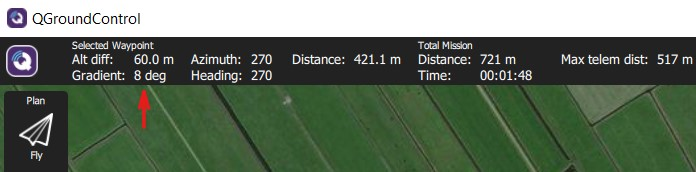
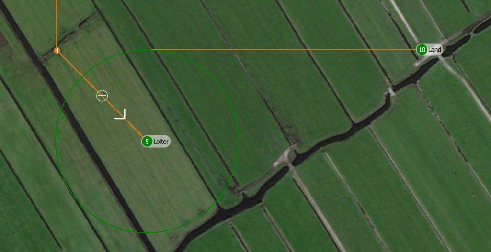
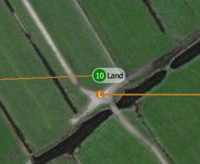

# Planning a mission

The DeltaQuad has been designed to fly autonomously, this is achieved by planning and executing missions. Missions are set through the Ground Control Station. They can be created and sent to the vehicle directly, loaded from an existing mission plan, or saved to a mission plan. This section covers the basics of planning a mission for the DeltaQuad. For advanced usage of the mission planning features please review the [QGroundControl mission planning documentation](https://docs.qgroundcontrol.com/en/PlanView/PlanView.html).

## Preparing a mission plan

Before the mission plan can be created, the following steps should be taken to ensure safe execution:

1. A mission plan should only be executed after a thorough inspection of the entire mission on site. All altitude differences and obstacles should be known and taken into account.
2. Missions must be allowed to be executed in accordance with local laws and regulations.
3. The mission path must be free of obstructions for at least 200 meters in each horizontal direction.
4. During fixed-wing flight the vehicle should stay 50m above ground level, near the end of the mission, to reduce landing energy consumed, an altitude of 25m above ground is recommended.
5. For maximum endurance a takeoff altitude can be set to 25m, however, to ensure the safety systems can function properly, the takeoff altitude should be at minimum 60 meters above ground level.&#x20;
6. The takeoff and land sites must consist of a level, flat surface that is free of obstructions for at least 5x5 meters.
7. The takeoff altitude should be set high enough for the vehicle to be able to perform a transition in any direction.
8. The weather conditions must fall within the[ maximum allowed conditions](../vehicle-specifications.md).
9. Both the front and back transition paths must be planned in such a way that the vehicle is pointing with its nose towards the wind while performing the transition.
10. The intended mission should not consume more than 85% of the total energy available.
11. At any point in the mission, the vehicle must be able to return to its takeoff point in a straight line at its current altitude.
12. At any point in the mission, the vehicle must be able to initiate an unscheduled landing without causing damage to itself or its environment.

## Video instruction

For video instruction on planning a mission please visit [https://www.youtube.com/watch?v=7FOLx5L5\_sw](https://www.youtube.com/watch?v=7FOLx5L5\_sw)

## DeltaQuad Mission Validator

After planning your mission you can validate it using the [DeltaQuad Mission Validator](https://validator.deltaquad.com/)

The Validator will check your mission for feasibility, sanity, and safety. It will also check weather conditions, terrain altitudes, and no-fly zones. The DeltaQuad Mission Validator can not be used as an authoritative validation, it is provided as an additional verification system and all validations should be verified manually.

### Best practices and tips

* A vertical takeoff or landing consumes significantly more energy than a fixed-wing flight. For maximum efficiency, an altitude between 20 and 30 meters is recommended for landing. A takeoff altitude should be at minimum 60 meters for all safety systems to function.
* The altitude of the "Landing point" defines the expected touch-down altitude.&#x20;

* The back transition from fixed-wing to quadcopter flight is performed at the altitude set in the Final approach of the "Landing Pattern" command.

* Most wind forecasts are based on ground-level wind. Even 10 meters above the ground the wind can be significantly stronger. The [DeltaQuad Mission Validator](https://validator.deltaquad.com/) will indicate estimated wind levels at transition and cruise altitude.
* During the transition phase of the "Transition Direction" item, the vehicle has limited navigational abilities and could drift from its intended direction. The transition should therefore always be performed at an altitude where it is safe for the vehicle to perform the transition in any direction.
* Validate your mission in the [DeltaQuad Mission Validator](https://validator.deltaquad.com/)

## Plan view

Planning a mission can be done from the [Ground Control Station](ground-control-station-overview.md) by entering the Plan View.

The Plan View is used to plan autonomous missions for your vehicle. Once the mission is planned and sent to the vehicle, switch to the [Fly View](executing-and-monitoring-a-mission.md) to perform [pre-flight checks](pre-flight-checks.md) and fly the mission.

The image above shows a simple mission that starts with a "Launch" and a "Transition Direction" item. The mission continues to fly through three waypoints which are followed by a "Landing Pattern", ending in a  "Land" command at the indicated location.

The steps for creating missions are:

1. Change to Plan View.
2. Add commands to the mission and edit as needed.
3. Send the mission to the vehicle.
4. Change to Fly View and fly your mission.

## Plan Tools

On the left edge of the screen, you will see the Plan Tools.&#x20;

The order of the tools from top to bottom is:

* Fly View
* File (Sync)
* Takeoff
* Waypoint
* [Pattern (Survey)](https://docs.deltaquad.com/deltaquad-operation-manual/deltaquad-pro-map/survey-missions)
* Land
* Center map

### Add Commands

The first items to be placed in a mission are the "Launch" and "Transition Direction" items.

Click to activate the "Takeoff" tool.&#x20;

While active, clicking on the map will add a "Launch" and a "Transition Direction" item at the clicked location with direction North.&#x20;

By default, the distance between the "Launch" and "Transition Direction" item is at the recommended minimum of 300 meters.

* If the DeltaQuad is connected to the Ground Control Station the "Launch" item will be automatically placed where the DeltaQuad is positioned.

* On the right side of the screen, you find the mission command list where all commands such as waypoints are accessible and can be edited by clicking on the individual items.  &#x20;

* The first waypoint in the mission command list is called "VTOL takeoff" command. On the map, it is displayed as "T-Transition Direction". This waypoint will be the position the DeltaQuad flies to after it has ascended vertically to the altitude defined in the VTOL takeoff command. i.e. if the first waypoint is set at 60 meters altitude and 300m north of the current position, the DeltaQuad will ascend to 60 meters, transition to forward flight, and proceed 300m north.

* Set the desired transition altitude. A minimum altitude of 25 meters is recommended, the takeoff altitude should never be below 20m. As mentioned before, for all safety systems to function properly, the takeoff altitude should be at minimum 60 meters.

**Note:** The first waypoint should be a minimum of 300m, and a maximum of 800m away from the takeoff position.\
**Note:** The vehicle has been designed to transition into the direction it was when positioned on the ground. This allows the operator to perform upwind transitions, regardless of the mission plan. During the transition phase, the vehicle may travel as much as 300 meters. The mission plan should account for this.\
**Note**: During the transition phase the vehicle's heading may change due to wind influence. The mission plan should account for this.

## Set intermediate waypoints.

The DeltaQuad will proceed to these waypoints, continuing in fixed-wing mode.

* Activate the "Waypoint" Tool by clicking on it.

* Click on the map to select the desired position.

* Set the desired altitude the vehicle should have when reaching this position.

**Note:** The vehicle will fly from its current altitude to the defined altitude linearly and reach the target altitude when arriving at the waypoint.

**Note:** The ground control station will indicate the Gradient (degrees of climb along the path). The gradient should not exceed 10 deg.

### Set landing waypoint

* Select the "Land" Tool.

* Click on the map to select the desired position.
* The "Land" Tool creates a "Loiter" waypoint where the DeltaQuad circles and descends to the set altitude for the final approach.&#x20;

* The altitude of the final approach should be between 20m and 30m. The Loiter Radius needs to be at 100m. The second item created by the "Land" Tool is the "Land" item. The distance between the "Land" and "Loiter" item will be automatically set to 300m. You can change this distance by dragging the "Land" item on the map. The recommended minimum distance between "Loiter" and "Land" is 250m.

.jpg>)

* The "Land" Tool automatically positions the "Loiter" and "Land" items in the same direction as the "Launch" and "Transition Direction" items. As the DeltaQuad needs to launch and transition into the wind it also needs to do the final approach and landing into the wind.

* If the DeltaQuad is connected to the Ground Control Station you will have the option to click anywhere on the map to set the landing point or set the landing point to the vehicle location. By choosing the last option the landing point is automatically the same as the takeoff point.

* If the DeltaQuad is not connected to the Ground Control Station you can either click anywhere on the map for the landing point or choose the takeoff point as the landing point manually. Just click on the map close to the takeoff point. When applied drag the "Land" item on top of the "Launch" item.

* The altitude of the "Landing point" is the relative altitude to the "Launch" item where the vehicle is expected to touch down. When landing at the same altitude where the takeoff occurred this can be left at 0.

### File/Sync

The "File" Tool allows you to move missions back and forth between QGroundControl and your Vehicle. Before you fly a mission you must be sure to upload your mission to your vehicle. If you have made changes to your mission which you have not sent to your vehicle a blinking button will appear in the Plan Toolbar reading "Upload Required".&#x20;

The "File" tool will change to have an "!" within it to indicate that you made changes to your mission which you have not sent to your vehicle.

The "File" Tool provides the following functionality:

Create Plan

* Blank - Start a mission from scratch.
* Survey, Corridor scan, and Structure scan - Provides templates for specific tasks.

Storage

* Open
* Save
* Save As...
* Save Mission Waypoints As KML...

Vehicle

* Upload - Send to Vehicle.
* Download - Load from Vehicle.
* Clear - Clear mission from the vehicle.

To ensure the mission was correctly sent to your vehicle it is recommended to perform a "Download" from the vehicle after performing an "Upload" to the vehicle and verify the correct mission is loaded.

## Mission Command List

On the right edge of the display is the list of mission commands for this mission. You can click on one of these to edit the values for the item. Above are a set of options to switch between editing the Mission and GeoFence. Rally Points are currently not supported.

### Mission Command Editors

Click on a mission command to show its editor which allows you to specify the values for the command. You can also change the type of the command by clicking on the command name. This allows you to choose from a set of available commands to build your mission. The trash bin left to the command name deletes the command. To the right of the command name is a menu you can open by clicking. This menu provides you access to additional options.

### Launch item

When planning a mission,  the "Launch" item is shown. This is used to simulate the home position of the vehicle such that waypoint lines can be drawn correctly to the first actual waypoint. Keep in mind that the actual home position for a mission is set by the vehicle at the takeoff position and may differ from the "Launch" position.

## Mission Display

In the center of the map, you will see a visualization of your current mission. You can click on the waypoint indicators to select them and also drag them around to move.

## Mission Height Display

At the bottom of the map, the "Mission Height Display" is located.

The letters and numbers at the bottom of the "Mission Height Display" indicate the mission commands and waypoints. The orange graph on top indicates the altitudes of the different mission commands and waypoints and the altitude changes of the Deltaquad. The green graph in the middle represents the relative height above ground level.&#x20;

The orange graph will become red in case a waypoint or the trajectory between two waypoints is lower than the ground elevation. That means that you have a collision with the ground.

On the "Mission Display", you can also see a collision between two waypoints. The orange line turns red when a collision with the ground is detected.

The ground level is an estimation based on satellite surveys, these do not account for structures like buildings, power lines or trees. A visual on-site inspection must always be performed.&#x20;

The [DeltaQuad Mission Validator](https://validator.deltaquad.com/) will verify terrain altitudes across the entire mission path.

The "Zoom Tool" is located on the left corner above the "Mission Height Display".

Use the "plus" and "minus" sign to zoom in and zoom out. By pressing the letter "T", the "Mission Height Display" will be hidden.

