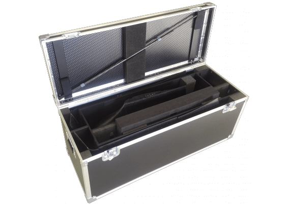

# Post flight

When the DeltaQuad has completed operations it should be switched off, inspected, dismantled and stored. Flight logs should be retrieved and registered.

## Switching off the vehicle

Before approaching the vehicle to switch it off note the following;

* The vehicle should never be approached when the motors are spinning.
* In the unlikely event of a crash, the vehicle should not be approached within 15 minutes. The battery could have been damaged and may ignite.
* Always stay clear of the propellers until the vehicle has been powered off by disconnecting the main flight battery.

To switch the vehicle off open the canopy clip and remove the lid. Then disconnect the main battery connector and remove the battery. The battery should be stored directly and safely.

## Inspect the vehicle

After a landing, specifically a hard landing or a grass landing, the DeltaQuad should be inspected for damage. Inspecting the vehicle visually at the landing site can help in determining the cause of any problems that might arise in the future. It is recommended, specifically when in doubt or with visible damage, to take pictures of the vehicle before dismantling it.

If there is any dirt on the vehicle or the propellers this should be removed with a damp cloth. Dirt on the wings, fuse or propellers will significantly impact the performance.

Special care must be taken to inspect the propellers both before and after every flight. If there is any visible or palpable damage to a propeller it should be replaced directly in accordance with the [preventative maintenance](../maintenance/preventive-maintenance.md) section.

## Dismantle the vehicle

Dismantle the vehicle in accordance with the [assembly](../setup/assembly.md) section. If you are able to transport and store the vehicle safely with only the wings detached this is recommended as it will reduce the risk of assembly problems.

**Note:** Never remove the carbon spars with the VTOL modules still attached. This can damage the wing joiner and void your warranty.

## Transporting and storing the vehicle

The DeltaQuad should be transported and stored inside the DeltaQuad Flightcase.

## Retrieving the on-board logs and registering the flight

After every session of flights the on-board logs should be retrieved from the SD-Card and the flight should be registered in the flight log. For more information on retrieving the on-board logs and maintaining the flight log, refer to the [flight logs](../maintenance/flight-logs.md) section.
