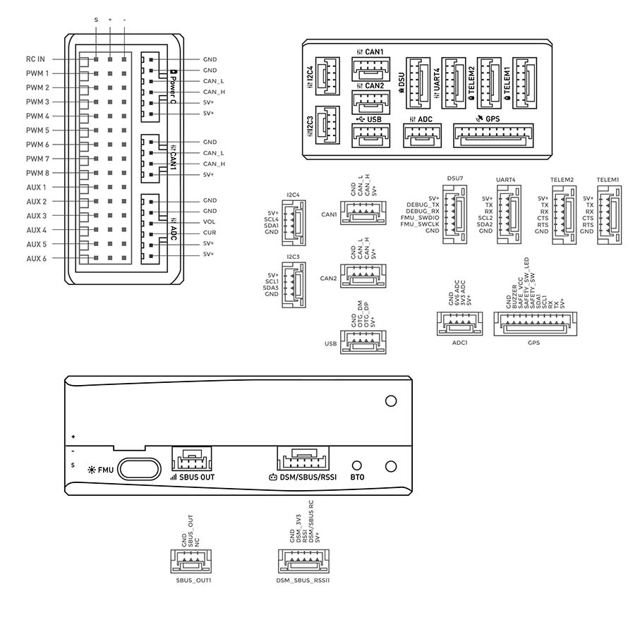

# Wiring diagram

The following schematic shows the correct wiring for the DeltaQuad Pro flight controller. Depending on the model and options, not all connections will be in use. Making changes to the configuration of your vehicle may impact your warranty. Before making any modifications always contact your DeltaQuad representative.

## Flight controller pinout

<figure><figcaption></figcaption></figure>

| **Connector** | **Type**                         | **Mating component**                                |
| ------------- | -------------------------------- | --------------------------------------------------- |
| RCIN          | DuPont 3 pin                     | Radio SBUS port                                     |
| PWM1          | DuPont 4 pin position 1 (green)  | Motor #1                                            |
| PWM2          | DuPont 4 pin position 2 (blue)   | Motor #2                                            |
| PWM3          | DuPont 4 pin position 3 (gray)   | Motor #3                                            |
| PWM4          | DuPont 4 pin position 4 (purple) | Motor #4                                            |
| PWM5          | DuPont 3 pin                     | Right wing servo                                    |
| PWM6          | DuPont 3 pin                     | Left wing servo                                     |
| PWM7          | DuPont 3 pin                     | Pusher motor thrust                                 |
| PWM8          | DuPont 3 pin (1 loaded)          | Pusher motor reverse                                |
| AUX1          | DuPont 3 pin                     | \*Stealth switch control                            |
| AUX2          | DuPont 3 pin                     |                                                     |
| AUX3          | DuPont 3 pin                     | \*ISR camera mount retract                          |
| AUX4          | DuPont 3 pin                     |                                                     |
| AUX5          | DuPont 3 pin                     | \*Camera trigger port 1 or Payload Drop Mechanism   |
| AUX6          | DuPont 3 pin                     | \*Camera trigger port 2                             |
| Power C       | Molex Mili-Grid 6 pin            | Power module                                        |
| Telem 1       | JSH-GH 6 pin                     | 
TRIP5 COM1 on #VIEW Radio UART0 on others
 |
| Telem 2       | JSH-GH 6 pin                     | \*ADS-B receiver                                    |
| UART 4        | JSH-GH 6 pin                     | \*Auxiliary telemetry or Ruggedized GPS             |
| GPS           | JSH-GH 10 pin                    | GPS                                                 |

\*Optional components

