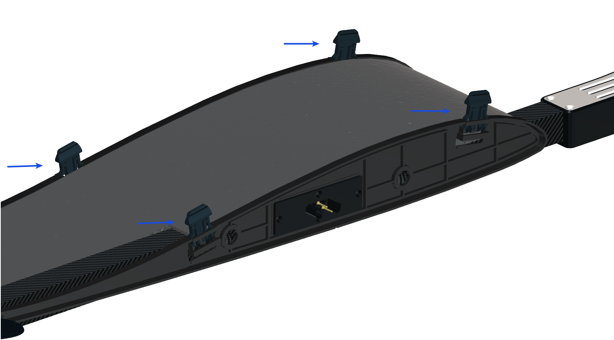
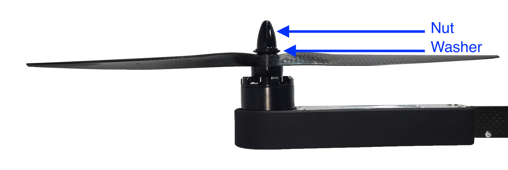
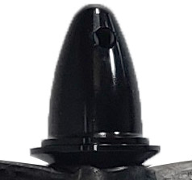

# Assembly

In this section we cover the steps for unpacking and assembling the DeltaQuad.

## Package contents

* 1 x Main fuselage
* 2 x Wing
* 2 x Carbon spar (1150mm and 850mm)
* 2 x VTOL module

Optional components:

* Battery charger
* Ground Control Station
* Radio Telemetry Bundle
* 4G Telemetry Bundle
* Auxiliary LiPo module
* Battery connector set

## Unpacking and initial hardware setup

For the initial hardware setup, make sure you have ample room to work. Carefully unpack all components from the box and inspect them for any damage. If there is damage to your vehicle please document and report this damage to Vertical Technologies.

### Inserting the carbon spars

Insert the 2 carbon spars through the fuselage. The short carbon spar (850mm) is inserted in front, the long carbon spar (1150mm) is inserted in the back. When inserting the front carbon spar, make sure that nothing is blocking the path of the spar inside the fuselage.

## Mounting the VTOL modules

The VTOL modules are indicated by the motor numbers, the module that has the motor numbers 1 and 4 is the right side module, the module that has the motor numbers 2 and 3 is the left side module.

Before sliding on the module make sure all lock pins on the module are in the open (up) position.

Slide the modules onto the carbon spars and push them firmly against the fuselage.

Lock the modules by pushing down the lock pins. Confirm each module is securely fastened.

## Mounting the Wings

After attaching the modules, make sure the lock pins on the wing side are in the open (up) position as shown on the image above.

Slide the wings over the carbon spars and press them firmly against the VTOL module. If you feel any resistance it is possible that the carbon spars are not properly centered.

Lock the wings by pushing down the lock pins on the VTOL module, and confirm the wings are securely fastened.

## Replacing the propellers

The DeltaQuad comes with 5 propellers, 1 composite "pusher" propeller, and 4 carbon fiber VTOL propellers. The propellers should already be attached when you receive the vehicle. When replacing the propellers please follow these guidelines.

The VTOL propellers consist of 2 Clock Wise (CW) propellers and 2 Counter Clock Wise (CCW).&#x20;

The motors are numbered 1 through 4. The bullet type nut on the propeller adapters are self tightening, that means they close by turning them in the **opposite direction** of how the motor/propeller spins. This is done to ensure the propellers do not become detached when the motor spins up. This means that to undo the nut on motors 1 and 2 it turns left, and on motors 3 and 4 it turns right.

The propellers are centered with a small ring inside the mount hole, this should result in the propeller sitting tightly around the shaft. Always make sure the centering ring is present and the propeller fits tightly around the shaft.

Mount the propellers in the following positions noting the direction of the propeller as indicated below:

The propellers are attached by removing the motor nut and washer, sliding the propeller on the shaft, sliding the washer on top of the propeller and fastening the nut.

Please make sure to install the washer in the right orientation. The washer has the wider side on top.

<figure><figcaption></figcaption></figure>

## Replacing the pusher propeller

The DeltaQuad pusher propeller is an APC 13x10EP propeller that contains a modified ring to mount properly on the DeltaQuad pusher motor. Please use DeltaQuad approved and balanced pusher propellers.

The pusher propeller should be mounted so that the propeller produces thrust towards the rear, this means that the top of the propeller (the side that has the text engraved) should face the motor as shown in the diagram below.&#x20;

**Note: When replacing propellers for the VTOL modules no lock bond is required as these are self-tightening. When replacing the pusher motor propeller lock bond is required on the propeller adapter nut as this motor can spin in both directions.**

**Note: All propellers are balanced in our factory by hand. This can leave scratch marks on the propeller blades. This does not indicate damage or that the propellers are used. A sign of damage can be structural weakness such as a bent propeller blade. If you find gouges or missing parts anywhere at the tip, the outboard region, or the trailing edge of the blade you need to replace the propeller.**

## Disassembly and storage

To disassemble the DeltaQuad open the lock pins for the wings and remove the wings.

**Note:** Never remove the carbon spars while the VTOL modules are attached. This could damage the wing-joiners.\
**Note:** Never store or put the vehicle with the LiPo battery inside the vehicle.

It is recommended to transport the DeltaQuad in the DeltaQuad Flight Case. If you do not have a DeltaQuad Flight Case It is recommended to transport and store the DeltaQuad with the VTOL modules attached.
